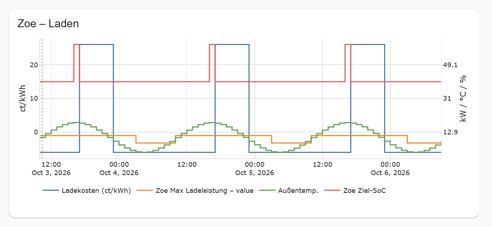

# Forecast Chart Card

**English** | [Deutsch](#deutsch)

Lovelace card that plots forecast list attributes as a time series (Plotly). Works with any
entity that has an attribute holding a list of objects with a timestamp and numeric values,
e.g. Template Forecast sensors, HAEO or EPEX Spot.



*Screenshot rendered with sample data.*

This folder is **self-contained** and does not depend on the Python integration, so it can be
moved to its own repository. The only link is
[`custom_components/template_forecast/frontend.py`](../custom_components/template_forecast/frontend.py),
which serves the build output
[`custom_components/template_forecast/www/forecast-chart-card.js`](../custom_components/template_forecast/www/forecast-chart-card.js)
and loads it in the frontend.

## Usage

Dashboard → Edit → Add card → **Forecast Chart**. The card picker shows a live preview, and the
chart is visible next to the editor while you configure it. Everything is configurable in the
visual editor, and the card can be re-opened and changed at any time (⋮ → Edit).

Per series source: entity → list attribute → time field → value field (all pre-selected by
auto-detection after you pick the entity), additional value fields, and per field a *Details*
section with name, color, scaling factor, offset, unit, line shape, Y axis and visibility.

### YAML

```yaml
type: custom:forecast-chart-card
title: EV charging
height: 320            # px, default 320
time_range: all        # all | from_now
show_now: true         # dotted "now" marker
show_legend: true
sources:
  - entity: sensor.haeo_zoe_ladekosten
    attribute: forecast      # optional, auto-detected
    time_key: time           # optional, auto-detected
    values:                  # optional, default: [value]
      - key: value
        name: Charging cost (ct/kWh)
        factor: 100
        offset: 0
        unit: ct/kWh
        color: "#4C78A8"
        shape: hv            # hv (steps, default) | linear
        axis: auto           # auto | left | right
        visible: true
      - key: outdoor_temp
        unit: °C
        axis: right
```

Notes:

- Values are plotted as `value * factor + offset`.
- `axis: auto` puts the first unit on the left axis and every other unit on the right one.
  Only two axes are supported.
- Time stamps are shown in the Home Assistant time zone. Strings without a time zone are
  interpreted in the browser's time zone.
- A broken series (missing entity, no list attribute, ...) shows a message below the chart; the
  other series are still drawn.

## Development

```bash
cd frontend
npm ci
npm test            # unit tests (auto-detection, series building, editor mapping)
npm run typecheck
npm run build       # writes ../custom_components/template_forecast/www/forecast-chart-card.js
```

The built bundle is committed on purpose (HACS installs straight from the repository); CI fails
if it is out of date. Plotly is bundled (`plotly.js-basic-dist-min`, scatter traces only), there is no
runtime dependency on any CDN or on `plotly-graph-card`.

Layout: `detect.ts` (auto-detection), `resolve.ts` (effective selection of a source),
`series.ts` / `figure.ts` (data → Plotly traces/layout), `schema.ts` (editor form mapping),
`card.ts` / `editor.ts` (custom elements), `i18n.ts` (en/de).

---

# Deutsch

[English](#forecast-chart-card)

Lovelace-Karte, die Forecast-Listenattribute als Zeitreihe darstellt (Plotly). Sie funktioniert
mit jeder Entität, die ein Attribut mit einer Liste von Objekten (Zeitstempel + numerische
Werte) besitzt, z. B. Template-Forecast-Sensoren, HAEO oder EPEX Spot.


*Screenshot mit Beispieldaten.*

Dieser Ordner ist **eigenständig** und hängt nicht von der Python-Integration ab, er lässt sich
also in ein eigenes Repository verschieben. Die einzige Verbindung ist
[`custom_components/template_forecast/frontend.py`](../custom_components/template_forecast/frontend.py),
das das Build-Ergebnis
[`custom_components/template_forecast/www/forecast-chart-card.js`](../custom_components/template_forecast/www/forecast-chart-card.js)
bereitstellt und im Frontend lädt.

## Benutzung

Dashboard → Bearbeiten → Karte hinzufügen → **Forecast Chart**. Der Karten-Dialog zeigt eine
Live-Vorschau, und das Diagramm ist beim Konfigurieren neben dem Editor sichtbar. Alles lässt
sich im visuellen Editor einstellen, und die Karte kann jederzeit erneut geöffnet und geändert
werden (⋮ → Bearbeiten).

Pro Serien-Quelle: Entität → Listen-Attribut → Zeitfeld → Wertefeld (nach der Entitätsauswahl
per Auto-Erkennung vorausgewählt), weitere Wertefelder und je Feld ein Bereich *Details* mit Name,
Farbe, Skalierungsfaktor, Offset, Einheit, Linienform, Y-Achse und Sichtbarkeit.

### YAML

Das Format ist identisch zum englischen Beispiel oben. Die Schlüssel sind englisch, die Bedeutung:

| Schlüssel | Bedeutung |
|---|---|
| `title`, `height` | Titel, Höhe in px (Standard 320) |
| `time_range` | `all` = gesamter Forecast, `from_now` = ab jetzt |
| `show_now`, `show_legend` | „Jetzt“-Markierung, Legende |
| `sources[].entity` | Entität |
| `sources[].attribute`, `time_key` | Listen-Attribut und Zeitfeld (optional, automatisch erkannt) |
| `sources[].values[].key` | Wertefeld (optional, Standard `value`) |
| `name`, `color`, `unit` | Anzeigename, Farbe (`"#4C78A8"`), Einheit |
| `factor`, `offset` | Skalierung: angezeigt wird `wert * factor + offset` |
| `shape` | `hv` = Stufen (Standard), `linear` |
| `axis` | `auto`, `left`, `right` |
| `visible` | `false` blendet die Serie aus (in der Legende wieder einschaltbar) |

Hinweise:

- `axis: auto` legt die erste Einheit auf die linke und jede andere Einheit auf die rechte
  Achse. Es werden nur zwei Achsen unterstützt.
- Zeitstempel werden in der Zeitzone von Home Assistant angezeigt. Zeitstempel ohne Zeitzone
  werden in der Zeitzone des Browsers gelesen.
- Eine fehlerhafte Serie (Entität fehlt, kein Listenattribut, ...) zeigt eine Meldung unter dem
  Diagramm, die übrigen Serien werden weiter gezeichnet.

## Entwicklung

Befehle siehe englischer Abschnitt oben (`npm ci`, `npm test`, `npm run typecheck`,
`npm run build`). Das gebaute Bundle wird bewusst eingecheckt (HACS installiert direkt aus dem
Repository); die CI schlägt fehl, wenn es nicht zum Quellcode passt. Plotly ist eingebaut
(`plotly.js-basic-dist-min`, nur Linien-Traces), es gibt keine Abhängigkeit zu einem CDN oder
zu `plotly-graph-card`.
